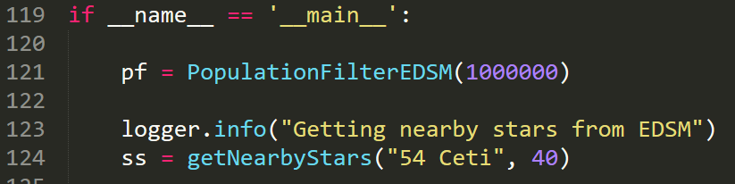

# EDMMT

Elite: Dangerous Manufactured Material Tracker

A software or script to track down every kind of possible G5 manufactured material in nearby systems.

Currently, I finished the core logic without many testing. No interfaces at present (2021 Nov. 6th 23:15 UTC), not even a command line one. If you want to change the parameters, you should change it in the code file. 

Tested Environment: Python 3.9.5

Packages required: json, requests, logging.

## How to use

Go to here.

- The number in line 121 is population threshold. If population in the system is under this, it will not be considered.
- `getNearbyStars`
  - First param is the system name of the searching center, only accept a string
  - Second param is the radius of searching range, in ly.

### Run

This is a python script for now, so run `python ./core.py` in your command prompt and wait for the result.

## Collaboration and Contributing

As you can see, this is a lame application with only core logic. 

I was on a speed run and only spent 5 hours on it, including the time to make a decision to make these.

It is far from a real application and yes I need collaborators. Please E-mail me or DM me on QQ if you want to collaborate. And I can only speak Chinese and English. Please contact me in one of these languages.

## Contact

My e-mail address: hty16@mail.ustc.edu.cn

Tencent QQ: 1481262620

My timezone: UTC+8 (Beijing, Shanghai, Singapore)

Language: Chinese, English

